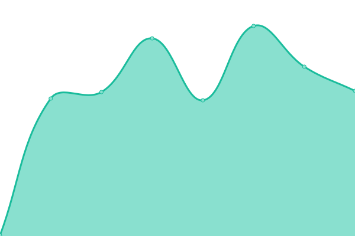

# [📈 Live Status](https://yudevment.github.io/yudevment-status): <!--live status--> **🟧 Partial outage**

This repository contains the open-source uptime monitor and status page for [YuiStar](https://yudevment.github.io/yudevment-status), powered by [Upptime](https://github.com/upptime/upptime).

With [Upptime](https://upptime.js.org), you can get your own unlimited and free uptime monitor and status page, powered entirely by a GitHub repository. We use [Issues](https://github.com/yudevment/yudevment-status/issues) as incident reports, [Actions](https://github.com/yudevment/yudevment-status/actions) as uptime monitors, and [Pages](https://yudevment.github.io/yudevment-status) for the status page.

<!--start: status pages-->
<!-- This summary is generated by Upptime (https://github.com/upptime/upptime) -->
<!-- Do not edit this manually, your changes will be overwritten -->
<!-- prettier-ignore -->
| URL | Status | History | Response Time | Uptime |
| --- | ------ | ------- | ------------- | ------ |
|  [NoMad App](https://appstatus.nm-bot.xyz/) | 🟥 Down | [no-mad-app.yml](https://github.com/yudevment/yudevment-status/commits/HEAD/history/no-mad-app.yml) | 

 0ms
     
 | 

<a href="https://yudevment.github.io/yudevment-status/history/no-mad-app">0.00%</a>
    

|  [NoMad Web](https://nm-bot.xyz/) | 🟩 Up | [no-mad-web.yml](https://github.com/yudevment/yudevment-status/commits/HEAD/history/no-mad-web.yml) | 

 582ms
     
 | 

<a href="https://yudevment.github.io/yudevment-status/history/no-mad-web">100.00%</a>
    

|  [NoMad Dash](https://dashboard.nm-bot.xyz/) | 🟩 Up | [no-mad-dash.yml](https://github.com/yudevment/yudevment-status/commits/HEAD/history/no-mad-dash.yml) | 

 483ms
     
 | 

<a href="https://yudevment.github.io/yudevment-status/history/no-mad-dash">100.00%</a>
    

<!--end: status pages-->

[**Visit our status website →**](https://yudevment.github.io/yudevment-status)

## 📄 License

- Powered by: [Upptime](https://github.com/upptime/upptime)
- Code: [MIT](./LICENSE) © [Anand Chowdhary](https://anandchowdhary.com), supported by [Pabio](https://pabio.com)
- Data in the `./history` directory: [Open Database License](https://opendatacommons.org/licenses/odbl/1-0/)
